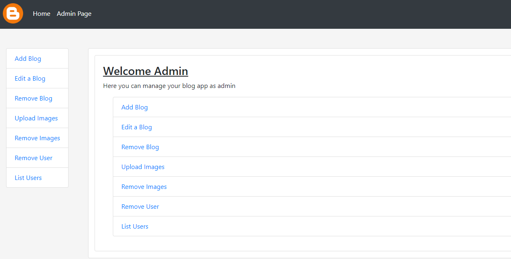
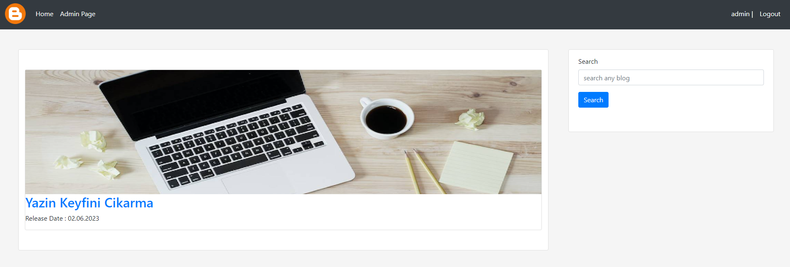
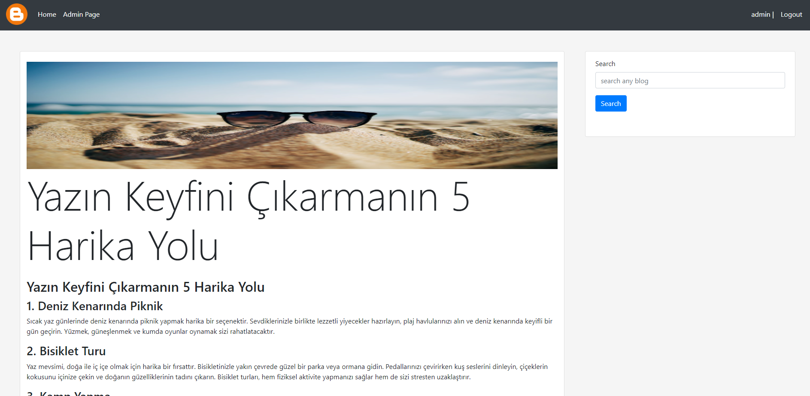

# PHP - BlogApp
Basic php blog site


## To Create the DataBase used in this project, use this query

```
CREATE DATABASE IF NOT EXISTS blogg_app;

USE test;

CREATE TABLE IF NOT EXISTS blogg_app (
    id INT PRIMARY KEY AUTO_INCREMENT,
    username VARCHAR(255) NOT NULL,
    password VARCHAR(255) NOT NULL
);

INSERT INTO users (id, username, password) VALUES (1, 'admin', 'admin');
```

## Admin Page
- You can manage blog pages, images and users from admin page




## Index Page
- You can see newest blogs, search for any blog, login or register from index page



## Blog Page Example



### ["Click Here"](https://www.youtube.com/watch?v=QNXKO976kHA) to see other features 
